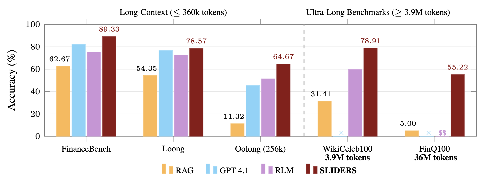

<div align="center">


# SLIDERS

### Contexts are Never Long Enough: Structured Reasoning for Scalable Question Answering over Long Document Sets


[](https://pypi.org/project/sliders-genie/)
[](https://arxiv.org/abs/2604.22294)
[](https://sliders.genie.stanford.edu)
[](https://oval.cs.stanford.edu/)
[](#license)

</div>

Real-world document corpora routinely exceed LLM context windows, forcing systems to rely on selective retrieval or chunk-by-chunk decomposition, both of which hit an *aggregation bottleneck* as the number of chunks grows. **SLIDERS** sidesteps this by extracting salient information into a **relational database**, reconciling evidence with an **LLM-driven SQL agent** that reads back per-row provenance and rationale, and then answering via SQL over the reconciled tables. On three existing long-context benchmarks (FinanceBench, Loong, Oolong), SLIDERS outperforms RAG, base-model, DocETL, Chain-of-Agents, and RLM baselines by an average of **6.6 points**. It is also the only method to scale to the two new ultra-long benchmarks we introduce — **WikiCeleb100** (3.9M tokens) and **FinQ100** (36M tokens) — improving over the next best baseline by ∼19 and ∼50 points respectively.

<p align="center">
  
</p>


## What's in this repository

- the full SLIDERS pipeline (contextualized chunking, schema induction, contextualized extraction, data reconciliation, SQL answer synthesis),
- benchmark drivers for **FinanceBench**, **Loong**, **Oolong**, **WikiCeleb100**, and **FinQ100**,
- implementations of the **Chain-of-Agents** and **RLM** baselines reported in the paper, and
- a standalone CLI (`run_sliders.py`) that lets you run SLIDERS on your own Markdown documents.

## Method Overview

SLIDERS converts unstructured documents into a persistent, queryable relational state in five stages:

1. **Contextualized Chunking** — augment each document with global metadata (title, description) and local structural tags (section headers, tables, figures), then split into locally self-contained chunks.
2. **Schema Induction** — induce a question- and document-type-aware relational schema, using a small library of schema-construction guidelines organized by query type (*Ordering*, *Multiple Choice*, *Other*) and document type (*Narration*, *Policy*, *Dataset*, *Other*).
3. **Contextualized Extraction with Relevance Gating** — for each chunk, a relevance gate decides whether the chunk contains evidence for the induced schema; only gated-in chunks are extracted. Each extracted cell is stored together with its **provenance quote** and **extraction rationale**.
4. **Data Reconciliation** — an LLM-driven SQL agent selects a primary key, partitions rows into key-based groups, and issues SQL programs to deduplicate, resolve conflicts, and consolidate partial records. Provenance and rationale are first-class signals that the agent reads back when deciding how to repair groups.
5. **SQL-based Answer Synthesis** — an answer agent writes and iteratively refines SQL against the reconciled database, then composes the final natural-language answer.

See Figure 3 and Section 2 of the paper for the full architecture diagram.

## Repository Layout

```
sliders/
├── run_sliders.py              # CLI entry point for ad-hoc user documents
├── sliders/
│   ├── run.py                  # Programmatic entry point
│   ├── runner.py               # Benchmark runner (reads configs/*.yaml)
│   ├── system.py               # SlidersAgent — the core pipeline
│   ├── baselines.py            # Chain-of-Agents / RLM / direct / sequential / question-guided
│   ├── experiments/            # Paper benchmarks: FinanceBench, Loong, Oolong, WikiCeleb, SEC 10-Q (FinQ100)
│   ├── modules/                # Schema induction, extraction, reconciliation, answer synthesis
│   ├── chunkers/               # Contextualized and JSON chunkers
│   ├── llm/ · llm_tools/       # LLM client (caching, retry) + SQL/code execution tools
│   ├── prompts/                # All task prompts grouped by module
│   └── sliders_taxonomy.json   # Schema-guideline library
├── configs/                    # 25 canonical YAML configs (see below)
├── sample_data/                # Per-benchmark evaluation ID CSVs from the paper
└── pyproject.toml              # uv-managed dependencies
```

## Installation

Install from PyPI:

```bash
pip install sliders-genie
```

Or install from source for development:

```bash
git clone https://github.com/stanford-oval/sliders-public.git
cd sliders-public
uv sync
```

Create a `.env` file in your working directory (or copy from `.example.env`). SLIDERS supports either **Azure OpenAI** (default) or the **public OpenAI API** — pick one:

```bash
# Option A — Azure OpenAI (default)
AZURE_OPENAI_API_KEY=<your-key>
AZURE_OPENAI_ENDPOINT=<your-endpoint>

# Option B — OpenAI
SLIDERS_LLM_PROVIDER=openai
OPENAI_API_KEY=sk-...

# Where to write logs and results
SLIDERS_LOGS_DIR=./logs
SLIDERS_RESULTS=./results
```

You can also pass credentials programmatically — see [Python API](#python-api) below.

## Running SLIDERS on Your Own Documents

SLIDERS accepts **Markdown** or **PDF** inputs. PDFs are auto-converted to Markdown on the fly via [Docling](https://github.com/docling-project/docling), which preserves tables, headings, and layout structure that SLIDERS' contextualized chunker relies on. The first PDF conversion will download Docling's layout models (~400 MB) — subsequent runs reuse the cache.

### CLI

```bash
# Single PDF
uv run python run_sliders.py --docs paper.pdf --question "What are the key findings?"

# Multiple mixed-format files
uv run python run_sliders.py --docs a.md b.pdf c.pdf --question "Compare the results"

# Directory (Markdown and/or PDFs)
uv run python run_sliders.py --docs ./my_papers/ --question "Summarize the treatments"
```


| Flag               | Description                                                        |
| ------------------ | ------------------------------------------------------------------ |
| `--verbose`        | Show full pipeline logs in the terminal                            |
| `--debug`          | Save intermediate reconciliation tables as CSVs                    |
| `--output-dir DIR` | Set output directory (default: `./sliders_output/<timestamp>/`)    |
| `--config PATH`    | Use a custom YAML config instead of `configs/default_sliders.yaml` |


### Python API

```python
from sliders.run import run_sliders

# Credentials via environment / .env
answer = run_sliders(
    docs="./my_papers/",
    question="What are the key findings?",
)

# Pass Azure OpenAI credentials explicitly
answer = run_sliders(
    docs="./my_papers/",
    question="What are the key findings?",
    azure_api_key="YOUR_AZURE_KEY",
    azure_endpoint="https://YOUR_RESOURCE.openai.azure.com/",
)

# Or use the public OpenAI API — passing openai_api_key auto-switches providers
answer = run_sliders(
    docs=["paper1.pdf", "paper2.pdf"],
    question="Compare the results",
    openai_api_key="sk-...",
)

# Pin the schema. SLIDERS skips induction and uses exactly these tables / fields.
# Any missing metadata (data_type, description, ...) is filled in by the LLM;
# SLIDERS will not add tables or fields you didn't list.
answer = run_sliders(
    docs="sample_docs/",
    question="Compare the primary endpoints and effect sizes across trials.",
    schema={
        "tables": [
            {
                "name": "Trial",
                "fields": [
                    "trial_id",
                    "primary_endpoint",
                    "n_participants",
                    "treatment_arm",
                    "effect_size",
                ],
            }
        ]
    },
)

# Full result with debug tables
result = run_sliders(
    docs=["a.md", "b.md"],
    question="Compare the results",
    debug=True,
    output_dir="./results/",
    return_full_result=True,
)
print(result["answer"])
print(result["results_json_path"])
```


| Parameter            | Type                 | Description                                                                                   |
| -------------------- | -------------------- | --------------------------------------------------------------------------------------------- |
| `docs`               | `str` or `list[str]` | Directory, single `.md`/`.pdf` file, or list of files (PDFs auto-converted via Docling)       |
| `question`           | `str`                | The question to answer                                                                        |
| `verbose`            | `bool`               | Show pipeline logs                                                                             |
| `debug`              | `bool`               | Save intermediate tables as CSVs                                                               |
| `output_dir`         | `str`                | Output directory                                                                               |
| `config_path`        | `str`                | Custom YAML config path                                                                        |
| `return_full_result` | `bool`               | Return a dict instead of the answer string                                                    |
| `azure_api_key`      | `str`                | Azure OpenAI API key (falls back to `AZURE_OPENAI_API_KEY`)                                    |
| `azure_endpoint`     | `str`                | Azure OpenAI endpoint (falls back to `AZURE_OPENAI_ENDPOINT`)                                  |
| `openai_api_key`     | `str`                | OpenAI API key — passing this auto-switches the call to the OpenAI provider                    |
| `openai_base_url`    | `str`                | OpenAI-compatible base URL (defaults to `https://api.openai.com/v1`)                           |
| `schema`             | `dict` or `list`     | Optional user-pinned schema. See ["Pinning a custom schema"](#pinning-a-custom-schema) below.  |


With `debug=True`, intermediate reconciliation tables land under `<output-dir>/intermediate_tables/<table_name>/` as numbered CSVs (`01_pre_reconciliation.csv` → `05_final_table.csv`).

### Pinning a custom schema

By default SLIDERS induces the relational schema from the question and the document descriptions. If you already know what you want to extract — or you want the same schema across many questions on the same corpus — pass it directly via the `schema` argument.

`schema` accepts a list of table specs or a dict with a `tables` key. Each table has a `name`, an optional `description`, and a `fields` list. Fields can be plain strings (just the name) or dicts with any subset of `data_type`, `description`, `required`, `unit`, `scale`, `enum_values`, `normalization`. Anything you leave out is filled in by a single LLM call that is explicitly instructed **not** to add tables or fields you didn't list.

Minimal (field names only):

```python
run_sliders(
    docs="./papers/",
    question="Which trials report mortality benefit?",
    schema={
        "tables": [
            {"name": "Trial", "fields": ["trial_id", "population", "primary_endpoint", "mortality_hr"]}
        ]
    },
)
```

Fully specified (skips the completion LLM call):

```python
run_sliders(
    docs="./papers/",
    question="List doses and sample sizes.",
    schema={
        "tables": [
            {
                "name": "Trial",
                "description": "A clinical trial record.",
                "fields": [
                    {"name": "trial_id", "data_type": "str", "description": "Trial identifier", "required": True, "unit": None, "scale": None},
                    {"name": "dose_mg",  "data_type": "float", "description": "Dose in milligrams", "required": True, "unit": "mg", "scale": None},
                    {"name": "n",        "data_type": "int",  "description": "Number of participants", "required": True, "unit": None, "scale": None},
                ],
            }
        ]
    },
)
```

## Reproducing the Paper

Each benchmark driver expects the underlying dataset to be downloaded locally; update the `benchmark_path` / `files_dir` in the corresponding YAML (currently set to `/path/to/datasets/...` placeholders) to point at your copy.

```bash
# SLIDERS main results (Table 3)
uv run sliders/runner.py --config configs/benchmarks/finance_bench_sliders.yaml
uv run sliders/runner.py --config configs/benchmarks/loong_sliders_finance_en.yaml
uv run sliders/runner.py --config configs/benchmarks/loong_sliders_finance_cz.yaml
uv run sliders/runner.py --config configs/benchmarks/loong_sliders_legal.yaml
uv run sliders/runner.py --config configs/benchmarks/loong_sliders_papers.yaml
uv run sliders/runner.py --config configs/benchmarks/oolong_sliders_contextlen_256k.yaml
uv run sliders/runner.py --config configs/wiki_celeb_sliders.yaml
uv run sliders/runner.py --config configs/sec_10q_sliders.yaml
```

Baselines (Chain-of-Agents and RLM are implemented in this repo; RAG / LongRAG / GraphRAG / DocETL are not):

```bash
# Chain-of-Agents
uv run sliders/runner.py --config configs/benchmarks/finance_bench_coa.yaml
uv run sliders/runner.py --config configs/benchmarks/loong_coa_finance_en.yaml
uv run sliders/runner.py --config configs/benchmarks/loong_coa_finance_cz.yaml
uv run sliders/runner.py --config configs/benchmarks/loong_coa_legal.yaml
uv run sliders/runner.py --config configs/benchmarks/loong_coa_papers.yaml
uv run sliders/runner.py --config configs/benchmarks/oolong_coa_256k.yaml

# RLM
uv run sliders/runner.py --config configs/benchmarks/loong_rlm_finance_bench.yaml
uv run sliders/runner.py --config configs/benchmarks/loong_rlm_finance_en.yaml
uv run sliders/runner.py --config configs/benchmarks/loong_rlm_finance_cz.yaml
uv run sliders/runner.py --config configs/benchmarks/loong_rlm_legal.yaml
uv run sliders/runner.py --config configs/benchmarks/loong_rlm_papers.yaml
uv run sliders/runner.py --config configs/benchmarks/oolong_rlm_256k.yaml

# GPT-4.1 base model (direct, no tool use)
uv run sliders/runner.py --config configs/finance_bench_direct_without_tool_use.yaml
uv run sliders/runner.py --config configs/loong_direct_without_tool_use_finance.yaml
uv run sliders/runner.py --config configs/loong_direct_without_tool_use_legal.yaml
uv run sliders/runner.py --config configs/loong_direct_without_tool_use_papers.yaml
```

RLM requires the `rlm` package to be installed separately; see `sliders/baselines.py`.

## Development

- Format / lint: `uv run ruff format` and `uv run ruff check --fix`.
- Tests: `uv run pytest`.
- Pre-commit: `uv run pre-commit run --all-files`.

## Cite our work

If you use SLIDERS in your research or applications, please cite our work:

```bibtex
@misc{joshi2026sliders,
      title={Contexts are Never Long Enough: Structured Reasoning for Scalable Question Answering over Long Document Sets}, 
      author={Harshit Joshi and Priyank Shethia and Jadelynn Dao and Monica S. Lam},
      year={2026},
      eprint={2604.22294},
      archivePrefix={arXiv},
      primaryClass={cs.CL},
      url={https://arxiv.org/abs/2604.22294}, 
}
```

## License

Released under the MIT License. See `LICENSE` for details.
